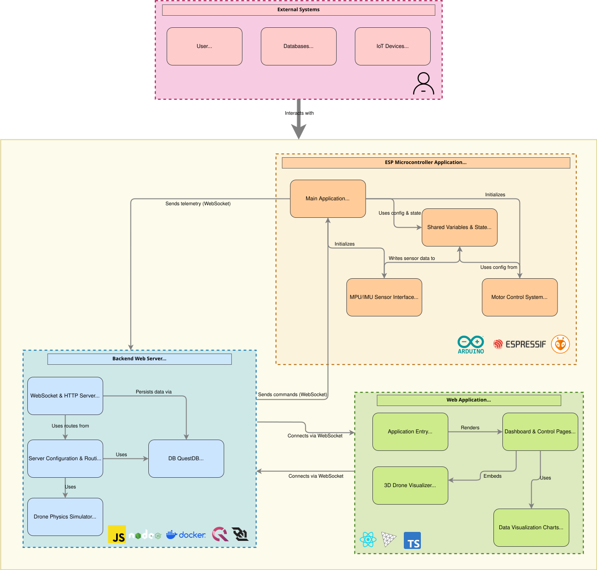

# Artheris FlightControl – WebSocket Interface for Real-Time Monitoring and Control of an IoT Drone

**Artheris FlightControl** is a modern, open-source ground station developed with web technologies, designed for real-time monitoring and control of an IoT quadcopter. It uses pure WebSocket communication to ensure low latency and high reliability in data transmission between the drone (based on an ESP32) and an intuitive web interface built with **React + TypeScript**.

This software was designed as a testing platform for experimentation and validation of control algorithms in **Unmanned Aerial Vehicles (UAVs)**, with a focus on accessibility, clear telemetry visualization, and robust data logging for scientific analysis and reproducibility.

---


## 🛰️ Key Features

- Real-time bidirectional communication via pure WebSocket.
- Advanced telemetry visualization (angles, altitude, motor PWM, sensor status, etc.).
- Remote command transmission to the drone: LED control, motor activation, and flight mode selection.
- Automatic flight logging and secure storage in a time-series database (QuestDB), enabling analysis and traceability.
- Simulation mode (in development) for testing without physical hardware.
- Intuitive and responsive web interface, built with React + TypeScript, compatible with both desktop and mobile devices.

---
### 🚦 Flexible Hardware Integration

- Compatible with multiple sensors (IMU, magnetometer, temperature, pressure, etc.).
- Modular architecture: easily adapt the system to different drone models or add new peripherals.

### 📡 Pure WebSocket and Modern Architecture

- Real-time communication without external dependencies, achieving low latency and high robustness.
- Decoupled backend and frontend: easily connect other interfaces (CLI, mobile, etc.).

### 📊 Real-Time Visualization and Analysis

- Interactive graphs for telemetry and commands.
- Flight history accessible from the web for analysis and comparison.

### 🛠️ Export and Reproducibility

- Export your flights and experiments to CSV/JSON for analysis in Python, Matlab, R, etc.
- Included scripts and templates to simplify ESP32 setup and connection.

### 🧑‍💻 Highlighted Use Cases

- **Education:** Ideal for lab practices in universities and technical training.
- **Research:** Base platform for experiments in control, robotics, or IoT.
- **Rapid Prototyping:** Perfect for makers and startups looking to validate connected drone ideas.

---

## 🔧 Requirements
### Hardware:

- **ESP32** board (or similar)
- Functional quadcopter with sensors (e.g., MPU6050, magnetometer)
- Ethernet network (no internet required)

### Software:

- Node.js (version 22 or higher)
- Visual Studio Code (or any other editor)
- Web browser (Chrome, Firefox, etc.)
- Docker Desktop (optional for QuestDB)

---

## 🗂️ Project Structure

The project is organized into two main parts:

- `/server`: Backend code in Node.js for WebSocket handling, data storage, and API.
- `/client`: Web interface in React + TypeScript for visualization and control.


_Reference image of the system architecture._

## ⚙️ Installation

**Prerequisites:**

- Node.js (version 22 or higher)
- npm
- (Optional) Docker Desktop for QuestDB
- Access to an ESP32 and local network (internet connection not required)

**Installation Steps:**

1. Clone this repository:

   ```bash
   git clone https://github.com/Diegui3o/websockets_web.git
   cd websockets_web
   ```

   Or download the compressed .zip file directly.

2. Install backend dependencies:

   ```bash
   npm install
   ```

3. Start the backend server:

   ```bash
   npm run dev
   ```

4. Open a new terminal and install frontend dependencies:

   ```bash
   cd client
   npm install
   ```

5. Start the frontend server:

   ```bash
   npm run dev
   ```

6. Open your browser at [http://localhost:5173](http://localhost:5173) to access the web interface.

**Note:** If you want to store flight data, make sure to have QuestDB running in Docker before starting the backend.

## 🚀 How to Use

Connect your ESP32 with the following configuration:

```bash
// ================= CONFIGURATION =================
const char *ssid = "Name_Wifi";
const char *password = "Password";
const char *websocket_server = "IP";
const int websocket_port = 3003;
const char *websocket_path = "/esp32";
```

For the "websocket_server", you need to set the IP address of your machine running the backend. To find it, open your command prompt:

```bash
cmd
```

Then run:

```bash
ipconfig
```

Look for the Ethernet adapter section, for example:

```bash
Ethernet adapter Ethernet::
   Specific DNS suffix  . . . . . . . :
   Link-local IPv6 Address . . . . . : oooo::oooo:oooo:oooo:oooo%o
   IPv4 Address. . . . . . . . . . . : xxx.xxx.1.11
   Subnet Mask . . . . . . . . . . . : yyy.yyy.yyy.0
   Default Gateway . . . . . . . . . : zzz.zzz.1.1
```

Fill the following fields with those values:

```bash
// ================= CONFIGURATION =================
const char *websocket_server = "xxx.xxx.1.11";

// Static IP configuration
IPAddress local_IP(xxx, xxx, 1, 200);
IPAddress gateway(xxx, xxx, 1, 1);
IPAddress subnet(yyy, yyy, yyy, 0);
IPAddress primaryDNS(8, 8, 8, 8);
IPAddress secondaryDNS(8, 8, 4, 4);
```

Use these variables in your WiFi and WebSocket setup:

```bash
WiFi.begin(ssid, password);
!WiFi.config(local_IP, gateway, subnet, primaryDNS, secondaryDNS)
webSocket.begin(websocket_server, websocket_port, websocket_path);
webSocket.onEvent(webSocketEvent);
webSocket.setReconnectInterval(3000);
webSocket.enableHeartbeat(15000, 3000, 2);
```
## Sending Telemetry Data

The function prepareAndSendMessage() collects important data from your drone’s sensors and control system, then combines all this information into a single text message. This message is sent through a WebSocket connection to the web interface, so you can see the drone’s status live on your screen.

Create a Message: It puts all these values together into one string separated by commas. This is like making a list of numbers in order.

Send the Message: It sends this string to the web interface using WebSocket, which allows real-time communication between the drone and your computer.

## Why do it this way?

Sending all data in a single message helps keep communication simple and well-organized.

Separating values with commas makes it easier to split and interpret the data on the receiving side.

Sending data in real time allows you to monitor your drone’s status instantly and respond with commands if needed.

## How to replicate this in your own drone code:

Collect the data you want to send (such as time, sensor readings, motor outputs).

Convert each data point to a string.

Join all the strings into one single line, separated by commas.

Use your WebSocket connection to send this combined string.

This approach makes it easier for beginners to send telemetry data with minimal code and helps the web interface display live data smoothly.

When the ESP32 connects successfully to the WebSocket server, your backend terminal will show a message like:

```bash
✅ ESP32 connected via pure WebSocket from ${clientIP}
```

Open the web interface at http://localhost:5173 to view flight data and send commands.

If QuestDB is enabled, flight data can be stored and analyzed later.

## 📄 License

This project is licensed under the MIT License.

